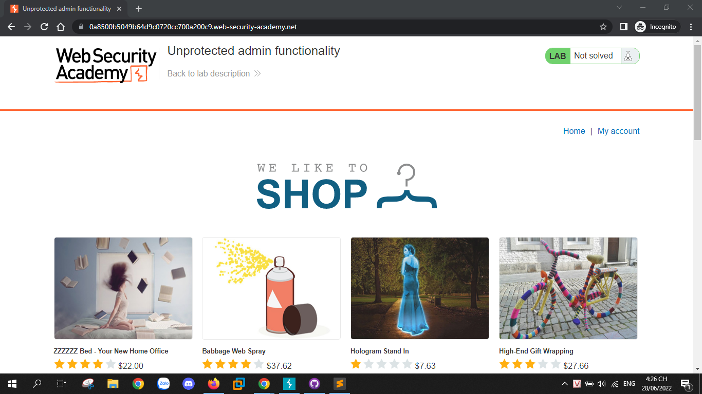
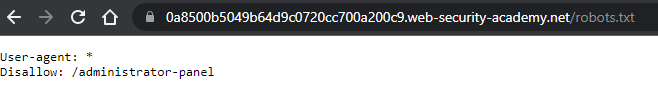
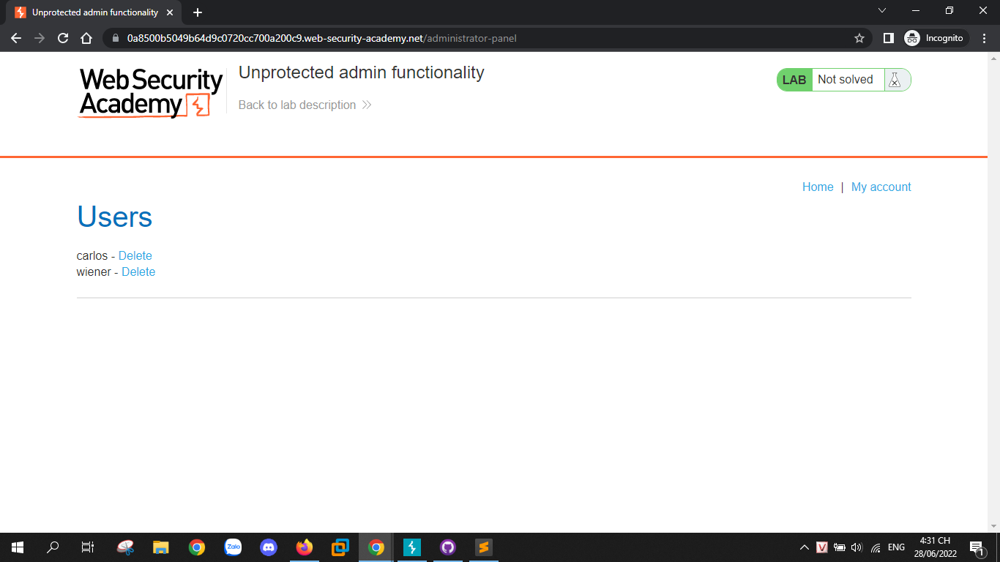
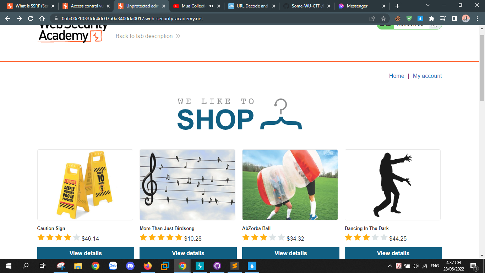
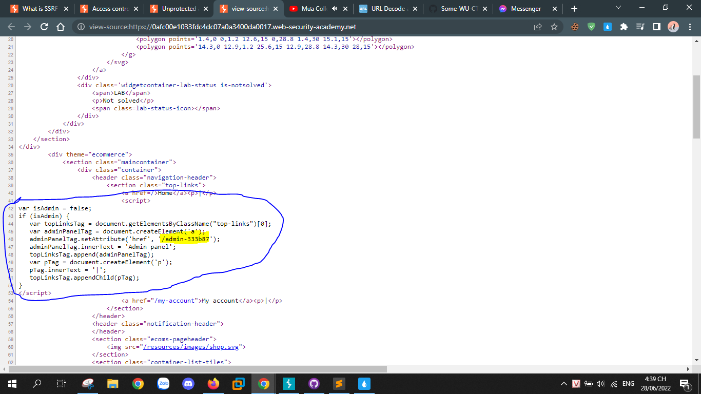

# Acces control vulnerabilities

## Lab 1: [Unprotected admin functionality](https://portswigger.net/web-security/access-control/lab-unprotected-admin-functionality)

Sau khi access the lab thì được chuyển hướng đến một website có giao diện như này.

Dạo một vòng không thấy có gì quá đặc biệt, vào thử `/robots.txt` thì thấy

Và khi vào `/administrator-panel` thì mình truy cập thẳng vào được admin panel, hehe và giờ thì mình delete profile của Carlos như yêu cầu lab.

## Lab 2: [Unprotected admin functionality with unpredictable URL](https://portswigger.net/web-security/access-control/lab-unprotected-admin-functionality-with-unpredictable-url)

Giao diện web sau khi access thì vẫn như cũ, vẫn là giao diện web quen thuộc.

Mình thử check source code và thấy đoạn script.

trong đoạn script có chứa path `/admin-333b87`, mình truy cập vào và như lab trên thì mình được chuyển đến admin panel, và, cuối cùng chỉ cần hoàn thành yêu cầu bài lab thôi.
