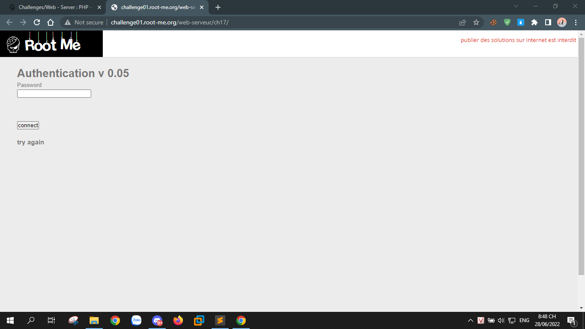
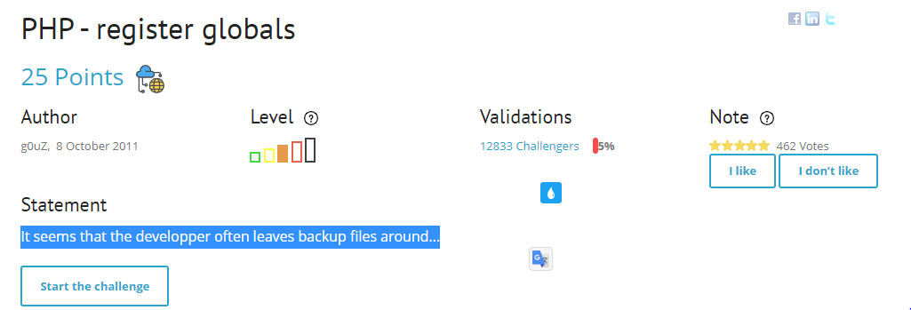
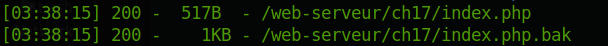
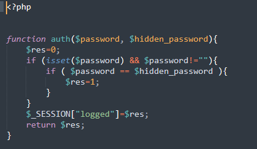
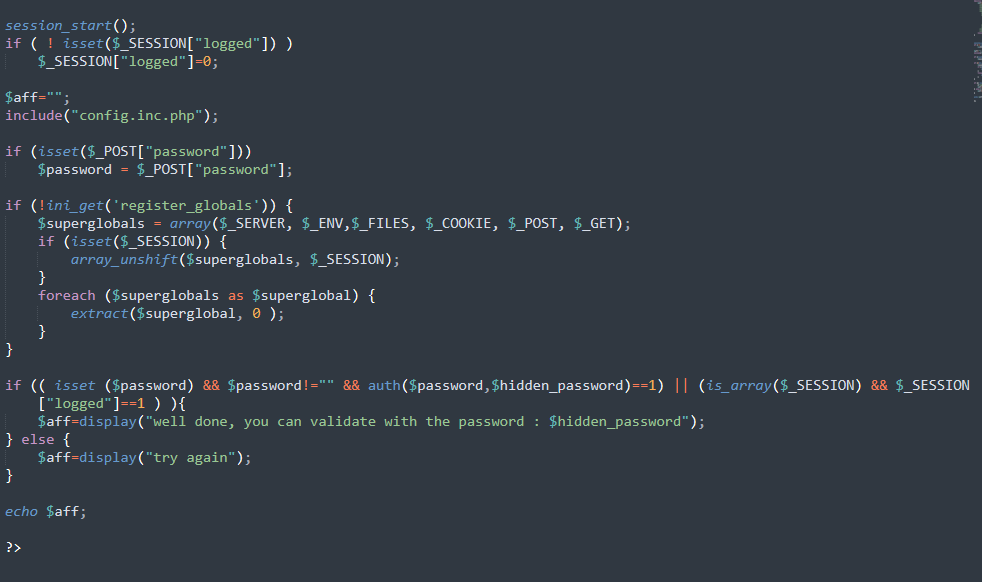
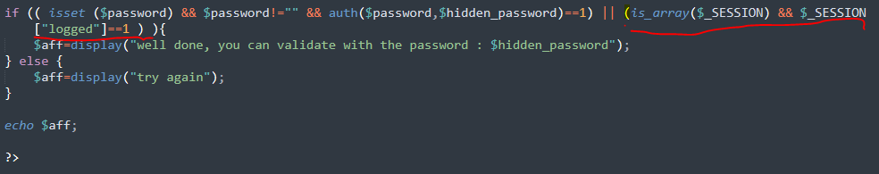
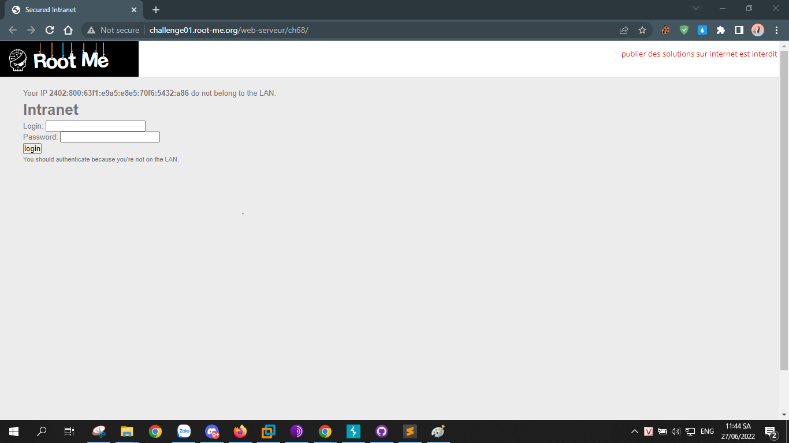
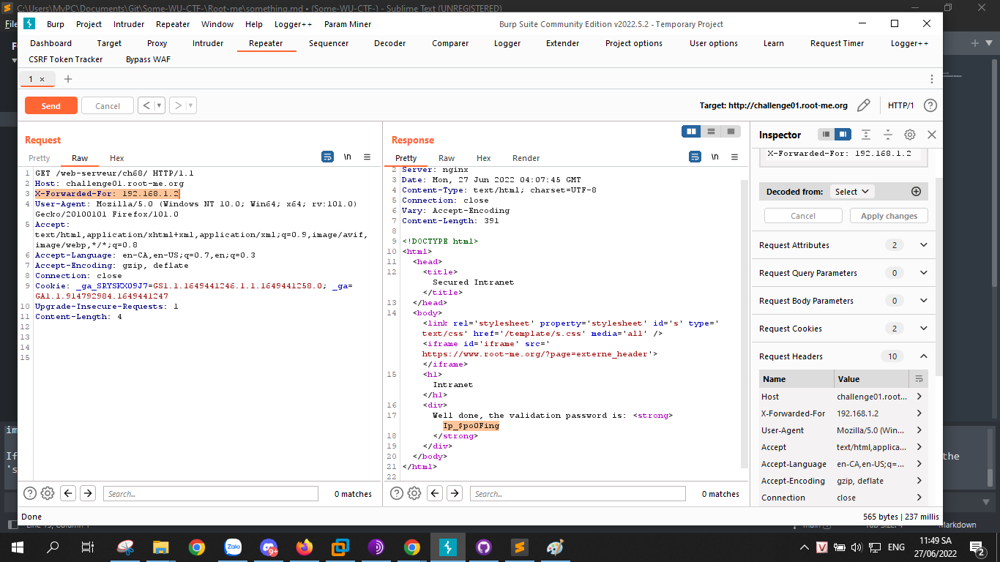

# Web - Server

### [PHP - register globals](https://www.root-me.org/en/Challenges/Web-Server/PHP-register-globals)

Sau khi vào sẽ thấy yêu cầu nhập mật khẩu, thử nhập vài giá trị, sau khi submit thì vẫn không chuyển tới trang khác mà vẫn ở trang cũ.

Ở đây, có gợi ý là tác giải đã backup file ở đâu đó, nên mình thử chạy dirsearch xem thế nào.
`python3 dirsearch.py -u http://challenge01.root-me.org/web-serveur/ch17/ -e php`

Truy cập vào `https://challenge01.root-me.org/web-serveur/ch17/index.php.bak` và tải về file index.php.bak và mở ra thì thấy được 2 đoạn thú vị.

Để hiện flag thì phải qua được đoạn so sánh ỏ hàm if này.

Ở đây, hàm yêu cầu password nhập vào phải trùng với hidden password hoặc `_SESSION("logged")==1`, không tìm ra hidden password thì mình tìm cách để `_SESSION("logged")==1`

> payload: `http://challenge01.root-me.org/web-serveur/ch17/?_SESSION[logged]=1`

Và thế là ta có flag ^^!

### [HTTP - IP restriction bypass](https://www.root-me.org/en/Challenges/Web-Server/HTTP-IP-restriction-bypass)

Sau khi mở challenge ta được chuyển hướng đến 1 website.

Ở đây, ta cần dùng ip của mạng LAN để có thể lấy flag.

Note: hệ thống mạng LAN và có dạng 192.168.1.1 đến 192.168.1.255

Ở đây mình dùng Burpsuit, và thêm vào Request headers `X-Forwarded-For: 192.168.1.2`

Và giờ thì mình có flag.
